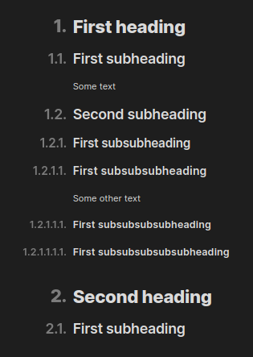

# Visual heading numbering for Obsidian

This plugin adds heading numeration to your Obsidian view.

It adds the headings only **visually** and _doesn't modify your files_! 🎉

-   All 6 heading levels

It also works in the ouline pane:

## Installation

The plugin is not yet available in Obsidian community plugin list, so it has to be installed manually for now.

### From GitHub

1. **Download** the [latest release](https://github.com/platon-ivanov/obsidian-visual-numbered-headings/releases/latest)
2. **Extract** the whole `obsidian-heading-count-plugin` folder from the zip to your vault's plugins folder: `<vault>/.obsidian/plugins/`
    > **Note**: On some machines the `.obsidian` folder may be hidden by default.
3. **Reload** Obsidian
    > **Note**: You might be prompted about [Restricted Mode](https://help.obsidian.md/Advanced+topics/Community+plugins#Safe+Mode). You can disable it and enable the plugin. Another way is to head to Settings → Community plugins. Disable Restricted mode and enable the plugin from there.
